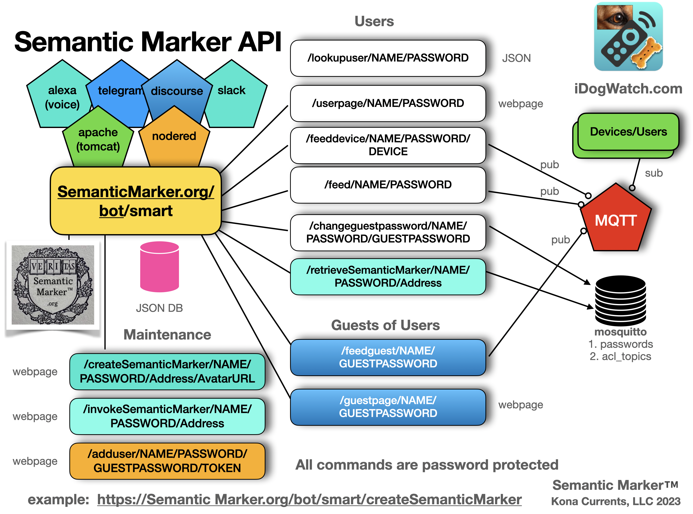
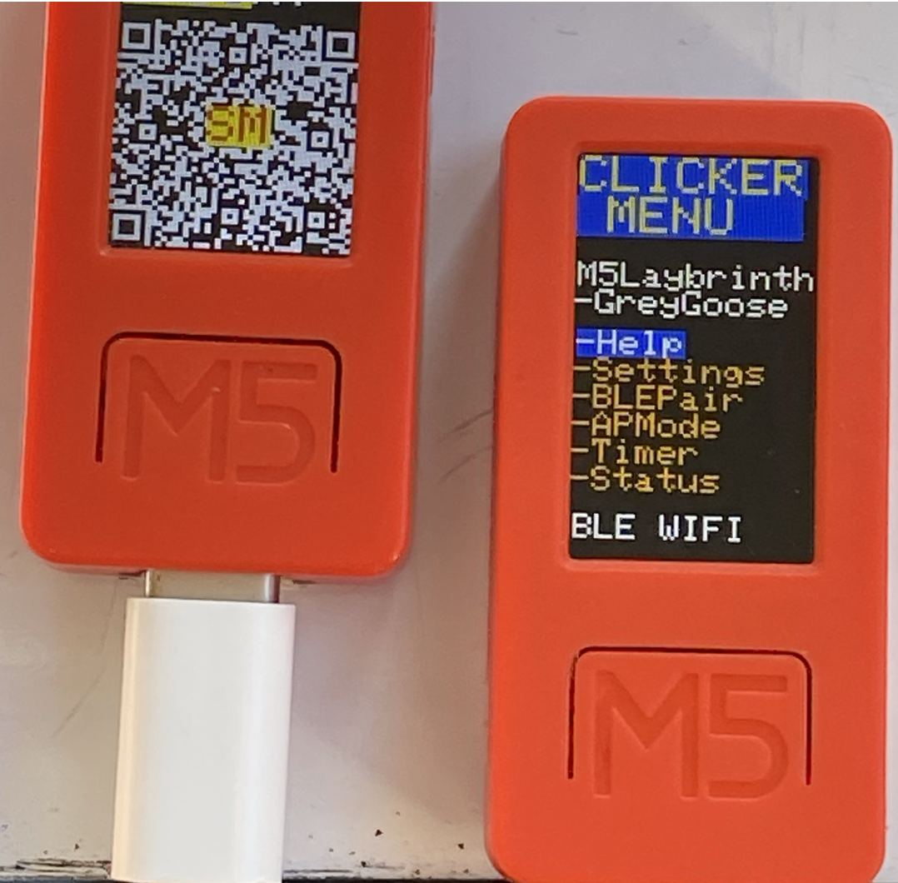
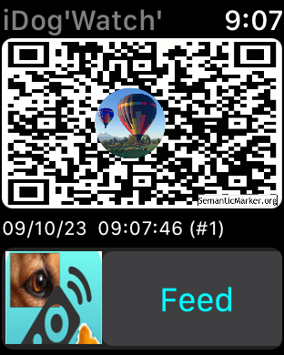
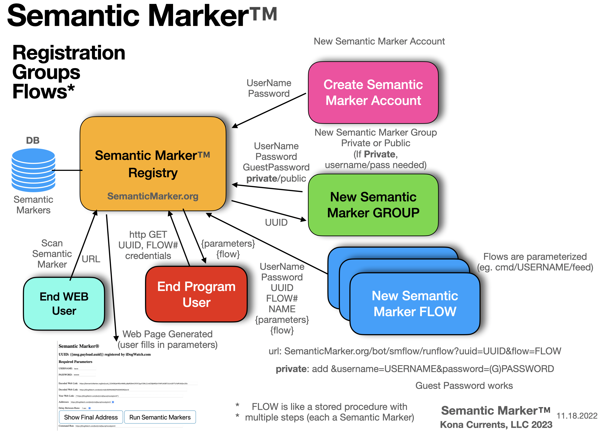
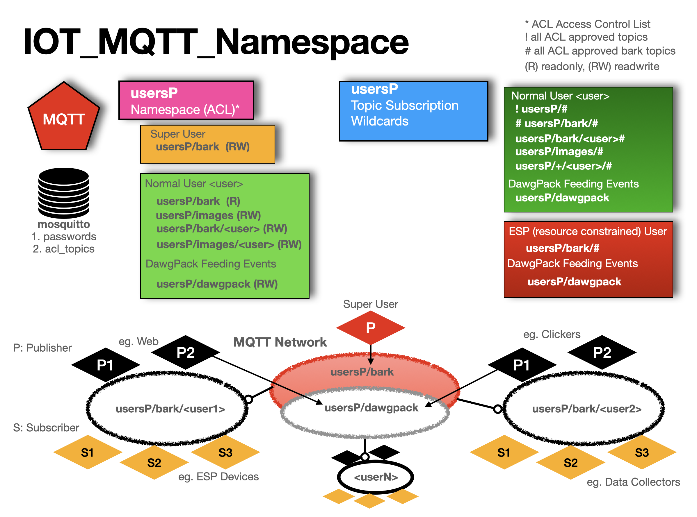

#  Semantic Marker ™️  REST and MQTT Message API Manual


Creating and processing with the Semantic Marker™️  System is through various APIs (Application Programer Interface). This GitHub repository includes code that makes web calls using the <b>HTTP</b> protocol and various languages, such as javascript, c and objective-c. The code included is mix of html and javascript. As these are a REST (HTTP) API, other languages make calls on these same web API's (such as the [curl](curlCommands) shell calls.) At the heart of the messaging API is the MQTT publish/subscribe engine described in the [BNF Language Grammar Specification](https://en.wikipedia.org/wiki/Backus-Naur_form).
and formatted through a collection of [JSON messages](#mqtt-messaging-using-bnf-grammar) sent over MQTT.
Our [Semantic Marker ESP-32 IoT Device](https://GitHub.com/konacurrents/SemanticMarkerESP-32) software download shows use of this MQTT messaging.

## SMART - Semantic Marker™️   Augmented Reality of Things

The main interfaces to the [SemanticMarker.org](https://SemanticMarker.org) web services are through 
calls embodied in the following web page code, and is available at 
[SemanticMarker.org/smart](https://SemanticMarker.org/smart). This web page (with html and javascript) is just one way to interface with the SemanticMarker API calls. Other web pages have been created that have a different user interface, while calling the same API's. In addition apps, like the [Semantic Marker iOS Apple App](https://semanticmarker.org/vision/testflight.html) are in various phases of development, also interacting with the same API's.

> [!NOTE]
> Many of these messages, after security matching, are then run through the MQTT publish/subscribe system described [later](#mqtt-messaging-using-bnf-grammar).


These fit an overall cloud and device interaction Semantic Marker™️   architecture shown here and currently hosted at [SemanticMarker.org](https://SemanticMarker.org).



> [!TIP]
> The versatility of these API's are denoted in upper left of diagram, through additional clients implemented for
> voice recognition (like Alexa, or Siri), and over messaging systems like telegram, X, discourse, nodered, apache (tomcat) and slack. 

# Semantic Marker™️  REST and MQTT API

The following are the main REST API calls to create and manage a Semantic Marker™️  . 
The current base URL for these is [SemanticMarker.org](https://SemanticMarker.org) but the entire set
can also be run locally or moved to other web servers. For the Semantic Marker™️   to be sharable and run
by outside parties, the Semantic Marker™️   address URL must be publically available 
(for example, **https://SemanticMarker.org** is globally accessible, while **http://localhost** would only be available for local use - such as a dog kennel operation.) 

> [!NOTE]
>  Throughout this API document, a black arrow  denotes expandable **details**. Clicking will expand that section 
> and show more information (such as the parameter details when using the API.)

The list of API calls is shown next with full details later in their appropriate sections. 

<details>
 <summary><code>Table of REST, MQTT and BLE API Calls</code> </summary>

> | name      |  description | parameters | protocol     | 
> |-----------|----------------------|---------------|------|
> | /exists/ks | query if Semantic Marker&trade; exists |{category}/{namespace} /{UUID}/{escapedSemanticMarker} | GET  |
> | /train/ks | train a Semantic Marker&trade; |{namespace}/{category} /{UUID}/{escapedSemanticMarker} | GET |
> | /sm | create a new Semantic Marker&trade; |{namespace}/{category} /{UUID}/digitize | POST |
> | /smflowpost |Create or modify Semantic Marker&trade; |JSON format | POST |
> | /invokeSemanticMarker|Invokes a Semantic Marker&trade; |{username}/{password} /{SemanticMarkerAddress}| GET |
> | /createSemanticMarker|Create a Semantic Marker&trade;|{username}/{password} /{SemanticMarkerAddress}/{AvatarURL}| GET |
> | /feed/Send feed command|{username}|{password}| GET |
> | /feeddevice|Send feed to specific named device|{username}/{password} /{devicename}| GET |
> | /lookupuser|Lookup user returning JSON|{username}/{password}| GET |
> | /set|sends a set/val|{username}/{password}/{command}/{value}| GET |
> | /setdevice|sends a set/val to device|{username}/{password} /{devicename}/{command}/{value}| GET |
> | /send|sends a request|{username}/{password}/{request}| GET |
> | /senddevice|sends a request to a device|{username}/{password} /{device}/{request}| GET |
> | /set64device|sends command in base64|{username}/{password} /{device}/{command}/{base64Val}| GET |
> | /command|send boolean command|{username}/{password} /{command}/{on/off}| GET |
> | /cmddevice|send boolean command to device|{username}/{password} /{device}/{command}/{on/off}| GET |
> | /addGroup|add to group|{username}/{password}/{group}| GET |
> | /removeGroup|remove from group|{username}/{password}/{group}| GET |
> | /statusGroup|send status to group|{username}/{password} /{group}| GET |
> | /feedGroup|send feed to group|{username}/{password} /{group}| GET |
> | /feedDeviceGroup|send feed to group and device|{username}/{password} /{device}/{group}| GET |
> | /captureGroup|sends capture to group|{username}/{password}/{group}| GET |
> | /addDeviceToGroup|adds device to group|{username}/{password} /{device}/{display}/{color}/{group}| GET |
> | /addUserToGroupTopic|add user to group|{group}/{username}/{TOKEN}| GET |
> | /addUser|creates user account|{username}/{password}/{guestpassword}/{TOKEN}| GET |
> | mosquitto_pub |publish on topic| -i userID -u username -P password -t topic -m PAYLOAD | MQTT |
> | mosquitto_sub |subscribe to topic| -i userID -u username -P password -t topic | MQTT |
> | addMosquitoUser|Add guest user to group|  user password guestPassword | MQTT |
> | addMosquitoGroup|Add user to group|  user group | MQTT |
> | /connectBLE | Binds to the BLE device| service characteristics | BLE |
> | /sendCommandBLE | Sends character over BLE| character | BLE |
> | /sendJSONCommandBLE | Sends JSON over BLE| JSON | BLE |
</details>

## Other API calls over Bluetooth

These consist of single character commands (so bluetooth clients with length restrictions can send commands), and 
JSON formatted messages which is a subset of [JSON messages](#mqtt-messaging-using-bnf-grammar) sent over MQTT.

<details>

 <summary><code>BLE Bluetooth ESP-32 Device Interfaces</code> </summary>

 Must <b>Discovery</b> and <b>Bind</b> to desired device.
</details>

<details>
 <summary><code>/connectBLE</code> <code><b>connect to BLE service</b></code></summary>

#### Parameters

> | name      |  value     | description                                                           |
> |-----------|-----------|-------------------------|
> | SERVICE_UUID |   B0E6A4BF-CCCC-FFFF-330C-0000000000F0                  | BLE Service UUID |
> | CHARACTERISTIC_UUID | B0E6A4BF-CCCC-FFFF-330C-0000000000F1 | BLE Characteristic UUID |

</details>

<details>
 <summary><code>/sendCommandBLE</code> <code><b>Sends Command Message over BLE</b></code></summary>

#### Parameters

> | value      |   description |
> |-----------|-----------|
> |H | help|
> |W | restartWIFI|
> |w | swap WIFI|
> |N | sendWIFI|
> |n | nextWIFI|
> |a | auto feed ON|
> |A | auto feed OFF|
> |j | jackpot|
> |B | buzzerOn|
> |b | buzzerOff|
> |s | single feed|
> |0x00 | single feed|
> |c | feed|
> |u | uno|
> |m | mini|
> |L | tumbler|
> |G | gatewayOn|
> |g | gatewayOff|
> |R | clean credentials - AP Node|
> |X | clean EPROM - Factory Reset|
> |E | use only PTFeeder naming|
> |e | use naming PTFeeder:name|
> |T | tiltOn|
> |t | tiltOff|
> |O | otaUpdate|
> |r | reboot |


</details>

<details>

 <summary><code>/sendJSONCommandBLE</code> <code><b>Sends Command Message in JSON format over BLE</b></code></summary>

#### Parameters

> | JSON value      |   description |
> |-----------|-----------|
> |{'cmd':'feed'} | feed |
> |{'cmd':'status'} | status |
> |{'cmd':'wifi'} | update WIFI |
> |{'ssid':'SSID','ssidPassword':'PASS'} | set SSID and SSID Password |
> |{'username':'NAME','password':'PASS'} | set username and Password for MQTT meessaging|
> |{'cmd':'sm1'} | M5 change to the s1 (or other) pages |
> |{'cmd':'clean'} | clean the EPROM |
> |{'cmd':'erase'} | erase the EPROM |
> |{'cmd':'poweroff'} | turn the power off on the device |
> |{'cmd':'ota'} | perform an OTA - Over the Air update |
> |{'cmd':'feed'} | perform a feed |
> |{'cmd':'buzzon'} | turn buzzer on |
> |{'cmd':'buzzoff'} | turn buzzer off |
> |{'cmd':'bleclienton'} | turn the BLE client feature on |
> |{'cmd':'bleclientoff'} | turn the BLE client feature off |
> |{'cmd':'bleserveron'} | turn the BLE Server on |
> |{'cmd':'bleserveroff'| |  turn the BLE Server off |
> |{'cmd':'resetfirsttime'} | reset the first time flag |
> |{'cmd':'reboot' | reboot the IoT device |
> |{'set':'BLEUseDeviceName','val':'on'"} | use the Device Name for the BLE name service name|
> |{'set':'BLEUseDeviceName','val':'off'"} | Don't use the Device Name for the BLE name service name|
> |{'set':'pairnow','val':'on'"} | have the device pair to the named pair device |
> |{'set':'timerdelay','val':'30'"} | set the timer delay to the val specified (eg. 30 sec) |
> |{'set':'startTimer','val':'on'"} | start the timer |
> |{"startTimer" val:@"off"} | stop the timer |
> |{'cmd':'zoomSMOn'} | M5 display zooms and shows the Semantic Marker&trade; |
> |{'cmd':'zoomSMoff'} | Don't show the Semantic Marker&trade; |
> |{'set':'tilt','val':'on'} | turn tilt detection on |
> |{'set':'tilt','val':'off'} | turn tilt detection off |
> |{'set':'gateway','val':'on'} | turn the gateway value on |
> |{'set':'gateway','val':'off'} | turn the gateway value off |
> |{'set':'hightemp','val':'88'} | set the high temp detector to the val |
> |{'set':'stepperangle','val':'30'} | change the stepper angle |
> |{'set':'screentimeout','val':'400'} | change the screen timeout |
> |{'set':'noclick','val':'400'} | change if no click since val to turn off |
> |{'set':'stepper','val':'mini'} | change the kind of stepper |
> |{'set':'stepper','val':'uno'} | change the kind of stepper |
> |{'set':'stepper','val':'tumbler'} | change the kind of stepper |
> |{'set':'device','val':'MyFeederName'} | name the device used in messages and BLE Device |
> |{'set':'location','val':'Buckley, WA USA'} | specify location to city/state/country |
> |{'set':'gen3only','val':'true'} | turn on gen3 pairing only |
> |{'set':'gen3only','val':'false'} | turn off gen3 pairing only |
> |{'send':'temp'} | sends the temperature of the device |
> |{'send':'capture'} | captures an image and sends it |
> |{'send':'volume'} | specify the volume to be sent |

</details>

> [!CAUTION]
> The ESP devices have a small buffer for accepting JSON messages (about 500 characters) so sending these
> JSON messages will be cut off if the message is too long (an error as not a valid JSON format.)

## Example Web Pages making REST API calls

An example html web page with many javascript calls via these REST API's is included at: [smart.html](smart.html)

Example production web pages includes making appropriate API calls includes:
[iDogWatch.com](https://idogwatch.com/userpage/userpage.html?username=test&password=test) and 
[SemanticMarker.org](https://SemanticMarker.org/smart?username=test&password=test)

In addition, applications such as we developed for the ESP-32 family of embedded IoT devices, show
use of this API. See [Semantic Marker ESP-32 Download](https://GitHub.com/konacurrents/SemanticMarkerESP-32) for an example.

------------------------------------------------------------------------------------------

# Kona Currents, LLC offers three tiers of Semantic Marker™️   offerings.

## Tier I. Semantic Marker™️   Indirection
## Tier II.  Semantic Marker™️   Store and Forward
## Tier III.  Semantic Marker™️   SMART Button Management

------------------------------------------------------------------------------------------
# Tier I Semantic Marker™️   Indirection

A Tier I Semantic Marker™️   is a straight indirection to a remote address. These are created
directly from the various language implementation. Examples of javascript, C and objective-c are shown. These
are snipits of code from various Semantic Marker™️   apps to give a flavor of the APIs.

<details>
<summary><code>Javascript</code> <code><b>new SemanticMarker</b></code></summary>

##### Example javascript
[Example HTML with javascript](sampleSMWeb.html)

The SMART web page makes calls through various javascript http calls (shown as XMLHttpRequest below). These are
embedded in the  [smart.js](smart.js) code modules.

Excerpt from html file:

```javascript
//The commandPath (the Semantic Marker™️   address is a parameter as is the avatarURL, and if the
//avatar is circular or rectangle).
function createSemanticMarker(commandPath, avatarURL, circular)
{
try
   {
   // http web call to get the image from the AvatarURL
      getImage(avatarURL).then
      (
         function (successurl)
         {

            var sm = new SemanticMarker(document.getElementById(idSM),
               commandPath,
               avatarURL,
               circular);
         }).catch (function (errorurl)
         {

            alert("Issue creating Avatar in Semantic Marker&trade; creation: \n" + errorurl + "\nPlease file bug report");
         })

   }
   catch (error)
   {

      alert("Issue with Semantic Marker&trade; creation: \n" + error.message + "\nPlease file bug report");
   }
}
```
#### Example of calling the web server to create a Tier II or Tier III Semantic Marker™️  

A typical <b>Http</b> web call looks like the following, passing in a command which includes calls to the appropriate web interface (for example https://SemanticMarker.org/bot/createSemanticMarker as shown in the diagram above). 

```javascript
//! sends the GET command to create a Semantic Marker
function createSemanticMarker(command)
{     
   var xhttp = new XMLHttpRequest();
   
   //!https://developer.mozilla.org/en-US/docs/Web/API/XMLHttpRequest/readystatechange_event
   xhttp.onreadystatechange = function() {
      // called when open is finished
      if (this.readyState == 4 && this.status == 200)
      {
          alert("SemanticMarker was created");
      }
   };

  xhttp.open("GET", command, true);
  xhttp.send();
}  

```
</details>


<details>
<summary><code>ESP-32 M5 Code</code> <code><b>create Semantic Marker</b></code></summary>

This is a simple example of creating a Tier I Semantic Marker™️   inside the ESP-32 code base.

##### Example ESP32 C Code
```c
   //!Draws a SemanticMarker&trade;
    //!Create a SemanticMarker code with a width of 135 QR code  at (0, 100).
    //!Please select the appropriate QR code version according to the number of characters. 
    createSemanticMarker("https://iDogWatch.com/bot/help",0,100,135);
    //try to draw a character in the middle ...
    printTextAtTextPosition("SM",_zoomedTextPositions[QRAVATAR_ACTION]);
```
#### Example Semantic Marker™️   shown on the small M5 Display 


</details>

<details>
<summary><code>Apple iOS Objective-C</code> <code><b>create Semantic Marker</b></code></summary>
This is a simple example of creating a Tier I Semantic Marker™️   inside the iOS Apple Objective-c code base.
The <b>createSemanticMarker</b> is a method that performs all the Semantic Marker™️   image merging and creation. The image merging is placing the avatarImage inside the resulting Semantic Marker™️   at a size and aspect ratio inherent to the Semantic Marker™️   specifications.

##### Example iOS ObjectiveC
```objectiveC
    //! create new image with the Avatar Logo inside
    UIImage *image = [self createSemanticMarker:address avatarImage:image];

```
#### Example functional Semantic Marker™️   with enclosed Avatar image



Note this image captured from the Semantic Marker™️   Apple Watch, shows the Semantic Marker™️   (where a long press will invoke the Semantic Marker™️   using the Tier III REST API), but also shows the <b>FEED</b> button. This makes a call on the <b>/feed</b> REST API shown below. 

</details>

------------------------------------------------------------------------------------------
# Tier II Semantic Marker™️   Store and Forward

A Tier II Semantic Marker™️   invoves storing information at one of our Semantic Marker™️   cloud servers. This
include an indirect address that a valid user can modify. Later, the Tier III Semantic Marker™️   provides
full user control.

## Creates a Tier II Semantic Marker™️   using the Semantic Marker Address (escaped)

### Exists - called to see if this Semantic Marker™️   has already been created
<details>
 <summary><code>GET</code> <code><b>/exists/ks/{category}/{namespace}/{UUID}/{escapedSemanticMarker}</b></code></summary>

#### Parameters

> | name      |  type     | data type               | description                                                           |
> |-----------|-----------|-------------------------|-----------------------------------------------------------------------|
> | namespace |  required | string                  | Namespace of Semantic Marker                                          |
> | category  |  required | string                  | Category of Semantic Marker                                          |
> | UUID      |  required | string                  | UUID of the user                                                      |
> | escapedAddress      |  required | string                  | The Semantic Marker Address is escaped so it is a single parameter argument|


#### Responses

> | http code     | content-type                      | response                                                            |
> |---------------|-----------------------------------|---------------------------------------------------------------------|
> | `201`         | `text/plain;charset=UTF-8`        | `Configuration created successfully`                                |
> | `400`         | `application/json`                | `{"code":"400","message":"Bad Request"}`                            |

#### Example cURL

> ```javascript
> set fullsm = "http://localhost:1880/exists/ks"
> curl -v  -F username=$user -F password=$pass -F link=$link -F kind=$kind $fullsm
> ```

</details>

### Assuming the Semantic Marker is unique, a new one is created (or trained)

### Train a semantic marker
<details>
 <summary><code>GET</code> <code><b>/train/ks/{namespace}/{category}/{UUID}/{escapedSemanticMarker}</b></code></summary>

##### Parameters

> | name      |  type     | data type               | description                                                           |
> |-----------|-----------|-------------------------|-----------------------------------------------------------------------|
> | namespace |  required | string                  | Namespace of Semantic Marker                                          |
> | category  |  required | string                  | Namespace of Semantic Marker                                          |
> | UUID      |  required | string                  | UUID of the user                                                      |
> | escapedAddress      |  required | string                  | The Semantic Marker Address is escaped so it is a single parameter argument|


##### Responses

> | http code     | content-type                      | response                                                            |
> |---------------|-----------------------------------|---------------------------------------------------------------------|
> | `201`         | `text/plain;charset=UTF-8`        | `Configuration created successfully`                                |
> | `400`         | `application/json`                | `{"code":"400","message":"Bad Request"}`                            |

##### Example cURL

> ```javascript
> set fullsm = "http://localhost:1880/train/ks"
> curl -v  -F username=$user -F password=$pass -F link=$link -F kind=$kind $fullsm
> ```

</details>

------------------------------------------------------------------------------------------
# Tier III Semantic Marker&trade; - SMART Buttons

A Tier III Semantic Marker&trade; provides storage for the Avatar image and for very fine control of
Semantic Marker actions. The created result is called a <b>SMART Button</b> - standing for Semantic Marker&trade; Augmented Reality of Things. 

> [!TIP]
> The resulting stored processing steps are especially suited to customized Internet of Things (IoT) processing, such as a custom user manual for your IoT home devices (eg. your accounts, passwords, WIFI address, and device Id's). These utilize all the API calls shown in this document but customized to your environment..

A SMART Button has a unique Semantic Marker&trade; address such as:

##### https://SemanticMarker.org/bot/smart?uuid=V6gZLkRley&flow=1698208438983

#### Creating a Semantic Marker with an embedded Avatar Image
##### Digitize an image for use in a Semantic Marker Avatar (Note should have been cropped by the user)
<details>
 <summary><code>POST</code> <code><b>/sm/{namespace}/{category}/{UUID}/digitize</b></code> </summary>

##### Parameters

> | name      |  type     | data type               | description                                                           |
> |-----------|-----------|-------------------------|-----------------------------------------------------------------------|
> | namespace |  required | string                  | Namespace of Semantic Marker                                          |
> | category  |  required | string                  | Namespace of Semantic Marker                                          |
> | UUID      |  required | string                  | UUID of the user                                                      |

##### Responses

> | http code     | content-type                      | response                                                            |
> |---------------|-----------------------------------|---------------------------------------------------------------------|
> | `201`         | `text/plain;charset=UTF-8`        | `http URL of resulting Avatar Image`                                |
> | `400`         | `application/json`                | `{"code":"400","message":"Bad Request"}`                            |

##### Payload
###### multipart/form-data

1.  Image file to be digitized

2. JSON of credentials

Like many of these interfaces, the credentials including the username and password, are passed as part of the payload in these POST calls.
```json
{
   "username":_username,
   "password":_password,
   "name" : flowName,
   "uuid" : uuid,
   "flowNum"  : flowNum,
   "flowCat"  : flowCat
}
```
##### Example cURL POST

> ```shell
> set fullsm = "https://SemanticMarker.org/bot/sm/$name/$cat/$uuid"
> curl --trace-ascii curl.trace  \
> -F filename=$filename \
> -F upload=@$filename \
> -F username=$user \
> -F password=$pass \
> -F link=$link \
> -F uuid=$uuid \
> -F flownum=$flownum \
> -F flowcat=$flowcat \
> -F kind=$kind \
> $fullsm
> ```

</details>


##### Create a SMART Button for an existing user of the Semantic Marker system
<details>
 <summary><code>POST</code> <code><b>/smflowpost</b></code> </summary>

##### Parameters

> | name      |  type     | data type               | description                                                           |
> |-----------|-----------|-------------------------|-----------------------------------------------------------------------|


##### Responses

> | http code     | content-type                      | response                                                            |
> |---------------|-----------------------------------|---------------------------------------------------------------------|
> | `201`         | `text/plain;charset=UTF-8`        | `http URL of resulting Avatar Image`                                |
> | `400`         | `application/json`                | `{"code":"400","message":"Your SemanticMarker Address was already registered."}`                            |

##### Payload
###### multipart/form-data

1. JSON of credentials for the SMART Button

Like many of these interfaces, the credentials including the username and password, are passed as part of the payload in these POST calls.
```json
{
    "username":_username,
    "password":_password,
    "name" : flowName,
    "uuid" : uuid,
    "isdata": isDataFlag,
    "private": privateflag,
    "flowNum"  : flowNum,
    "flowCat"  : flowCat,
    "date" : dateString,
    "parameters" : parameters,
    "desc": desc,
    "QRAvatarURL":QRAvatarURL,
    "nextFlowURL":nextFlowURL,
    "flow" : allCommandsJSON,

    "dataSM" : dataSM,
    "KSMatrix" : KSMatrixText,
    "artifactsSM" : artifactsSM,
    "markup" : markupText,
    "languagesSM": languagesSM,
    "videoSM": videoSM,
    "isCircularAvatar": isCircularAvatar,

    "KSWave" : KSWaveText,
    "bridgeSM" : bridgeSM,
    "future" : futureText,

    "audioSM" : audioSM,
    "locationSM" : locationSM,
    "inheritedSM" : inheritedSM,
    "deckSM" : deckSM,
    "isMessaging" : isMessaging,
    "isIndirectSM" : isIndirectSM,
    "indirectSM" : indirectSM
}
```
##### Example cURL POST

> ```shell
> set fullsm = "https://SemanticMarker.org/bot/smflowpost"
> curl --trace-ascii curl.trace  \
> $fullsm
> ```

</details>

# Semantic Marker&trade; Registry

The results of these REST calls are database entries in the Semantic Marker&trade; registry, as shown in this image.


------------------------------------------------------------------------------------------
# Messaging BNF Grammar 

These are the Websocket and MQTT messaging formats. This includes the original [iDogWatch](https://iDogWatch.com) websocket interface
defined as the <b>Barklet Language</b>. The format is a mix of original Barklet Language used with WebSockets,
and the newer JSON Format messages.

> [!NOTE]
> Many of the messages described in the following BNF Grammar can be run through the UNIX shell commands at: [Example curl commands](curlCommands) To run, download the scripts and run with a valid username and password. CURL is a tool to send web REST commands from the command line. 

## BNF Grammar for Barklet Language

```ebnf
  Description ::= Grammar for Barklet communication
   NOTE ::= {} are part of language not BNF
   NOTE ::= : <guest ID> ":"  created by chat-room, not user messages

    message          ::= [<guest ID> ":"] <payload> <player_name> [<time>] 
                    | '{' [<device>] <JSONMessage> '}'
    payload          ::= <request> [<deviceInfo>] [<SemanticMarker>] [<OTA>]| <reply>
    request          ::= #STATUS | #TEMP | #CAPTURE | #FEED 
	                 | #VERSION | #DOCFOLLOW | #followMe | #CLEAN_SSID_EPROM | #OTA
    reply            ::=  <connection>
                        | <location>
                    | <biometrics> <bot_name>
                    | <ack>
                    | <chat>
                    | <version>
                    | <distanceTo< <bot_name>
    SemanticMarker   ::= AVM= <SMAddress>
    SMAddress        ::= SemanticMarkerURL
    OTA              ::= {v=Version} | {k=<kind>}
    kind             ::= ESP_M5 | ESP_32
    connection       ::= <connectionStatus> <status>
    connectionStatus ::= <connectionPhase> <bot_name> | #REMOTE
    connectionPhase  ::= #CONNECTED | #WAITING | #DISCONNECTED
    status           ::= {I,F,remote}   //Inside network, Foreground  || Outside, background
    location         ::= #GPS <loc>
    loc              ::= {nil} | {<lat:float>,<lon:float>,<alt-feet:float>}
    chat             ::= #CHAT_CONNECTED | #CHAT_DISCONNECTED
    ack              ::= #ACK <ack_kind>
    ack_kind         ::= <ack_feed> | <docfollow>
    ack_feed         ::= "Fed" <bot_name>
    biometrics       ::= <temp> | <acceleration>
    temp             ::= {TempF=<float>}
    acceleration     ::= {Acc=<floatX>,<floatY>,<floatZ>}
    deviceInfo       ::= <identity> | {"deviceName":<name>}
    bot_name         ::= <identity>
    player_name      ::= <identity>
    identity         ::= {<name> [<UUID>]}
    UUID             ::= <32 bit name>
    float            ::= <int> : <int>
    time             ::= {hh:mm:ss}
    version          ::= {ver=x.x}
    number           ::= <int>
    boolean          ::= "on" | "off"
 
    JSONMessage      ::= <set> | <setdevice> | <send> | <set64> | <SemanticMarkerApp Messages>
    device           ::= "device" : name_of_device
    setdevice        ::= <device> <set>
    set              ::= "set" : setString , "val": valString
    send             ::= "send" : sendString
    set64            ::= "set64" : <encodedBase64String>
    setString        ::= "semanticMarker" 
                      | "highTemp" <number>
                      | "feed" <boolean>
                      | "status" <boolean>
                      | "resetTimer" <boolean>
                      | "devOnlySM" <boolean>
                      | "ble+wifi" <boolean>
                      | "factoryReset" <boolean>
                      | "restartModels" <boolean>
                      | "screenTimeout" <number>
                      | "stepperAngle" <number>
                      | "noclick"  <boolean>
                      | "gateway"  <boolean>
                      | "DiscoverM5PTClicker"  <boolean>
                      | "useSPIFF"  <boolean>
                      | "timerDelay" <number>
                      | "timerDelayMax" <number>
                      | "startTimer"  <boolean>
                      | "stepper"  <number>
                      | "clockWiseMotor" <boolean>
                      | "otaFile" <string>
                      | "location" <string>
                      | "device"  <string>
                      | "pairNow"  <boolean>
                      | "pairDev" <string>
                      | "useGroups" <boolean>
                      | "groups" <boolean>
                      | "screenColor" <number>
                      | "gen3only" <boolean>
                      | "BLEUsePairedDeviceName" <boolean>
                      | "BLEUseDeviceName" <boolean>
                      | "minMenue" <boolean>
                      | "addWIFI" <boolean>
                      | "useDOCFOLLOW" <boolean>
                      | "semanticMarker" 
                      | "blankscreen" <boolean>
                      | "SubDawgpack" <boolean>
                      | "buzz" <boolean>
                      | "BLEClient" <boolean>
                      | "BLEServer" <boolean>
                      | "tilt" <boolean>
                      | "zoomSM" <SMNum>
                      | "buttonA" ["longpress" | "shortpress"]
                      | "buttonB" ["longpress" | "shortpress"]

    sendString      ::= "temp" 
                      | "status" 
                      | "capture" 
                      | "volume" 
                      | "feed" 

    encodedBase64String ::=
                      |  <Semantic Marker value after decoding base64>

    SemanticMarkerAppMessages ::=
                      | DEBUG <boolean>
                      | HUD <boolean>
                      | MQTT_DEBUG <boolean>
                      | SMFocusCapture <boolean>
                      | SMSharing <boolean>
                      | SMSharingLeader <boolean>
                      | SM_AR_Minimal <boolean>
                      | SM_AR_ZOOM <boolean>
                      | SM_AR_Zoom <boolean>
                      | SM_Flip <boolean>
                      | SM_FlipRotate <boolean>
                      | SM_Instance_Image <boolean>
                      | SM_QRAvatar <boolean>
                      | SM_ReplaceUUID <boolean>
                      | SM_UseCropImage <boolean>
                      | SM_VisionLinker <boolean>
                      | animals <boolean>
                      | images <boolean>
                      | matrix <boolean>
                      | noclick <boolean>
                      | pause <boolean>
                      | pdf <boolean>
                      | replaceUUID <UUID string>
```


# The following are REST API's matching the BNF Grammar

> [!NOTE]
> In addition to the REST syntax, URL [query parameters](https://en.wikipedia.org/wiki/Query_string) are sometimes used. For example, 
> supplying query parameters and their values for  **username**, **password** and with a **JSON format** reply would look as follows:
>    **https://SemanticMarker.org/smart?username=x&password=y&format=JSON**

------------------------------------------------------------------------------------------
### invokeSemanticMarker - runs the Semantic Marker&trade;
<details>
 <summary><code>GET</code> <code><b>/invokeSemanticMarker/{username}/{password}/{SemanticMarkerAddress}</b></code></summary>

#### Parameters

> | name      |  type     | data type               | description                                                           |
> |-----------|-----------|-------------------------|-----------------------------------------------------------------------|
> | username |  required | string                  | username of user
> | password  |  required | string                  | password of user
> | semantic marker address  |  required | string                  | semantic marker address


#### Responses

> | http code     | content-type                      | response                                                            |
> |---------------|-----------------------------------|---------------------------------------------------------------------|
> | `201`         | `text/plain;charset=UTF-8`        | `Configuration created successfully`                                |
> | `400`         | `application/json`                | `{"code":"400","message":"Bad Request"}`                            |

#### Example cURL

> ```javascript
> set fullsm = "http://localhost:1880/invokeSemanticMarker/USERNAME/PASSWORD/SEMANTIC_MARKER"
> curl -v  -F username=$user -F password=$pass -F link=$link -F kind=$kind $fullsm
> ```

</details>

### createSemanticMarker - creates a Semantic Marker&trade;
<details>
 <summary><code>GET</code> <code><b>/createSemanticMarker/{username}/{password}/{SemanticMarkerAddress}/{AvatarURL}</b></code></summary>

#### Parameters

> | name      |  type     | data type               | description                                                           |
> |-----------|-----------|-------------------------|-----------------------------------------------------------------------|
> | username |  required | string                  | username of user
> | password  |  required | string                  | password of user
> | semantic marker address  |  required | string                  | semantic marker address
> | avatar URL |  required | string                  | image avatar URL 


#### Responses

> | http code     | content-type                      | response                                                            |
> |---------------|-----------------------------------|---------------------------------------------------------------------|
> | `201`         | `text/plain;charset=UTF-8`        | `Configuration created successfully`                                |
> | `400`         | `application/json`                | `{"code":"400","message":"Bad Request"}`                            |

#### Example cURL

> ```javascript
> set fullsm = "http://localhost:1880/createSemanticMarker/USERNAME/PASSWORD/SEMANTIC_MARKER/AVATAR_URL"
> curl -v  -F username=$user -F password=$pass -F link=$link -F kind=$kind $fullsm
> ```

</details>

### feed - sends the feed message to the ESP-32 devices
<details>
 <summary><code>GET</code> <code><b>/feed/{username}/{password}</b></code></summary>

#### Parameters

> | name      |  type     | data type               | description                                                           |
> |-----------|-----------|-------------------------|-----------------------------------------------------------------------|
> | username |  required | string                  | username of user
> | password  |  required | string                  | password of user


#### Responses

> | http code     | content-type                      | response                                                            |
> |---------------|-----------------------------------|---------------------------------------------------------------------|
> | `201`         | `text/plain;charset=UTF-8`        | `Configuration created successfully`                                |
> | `400`         | `application/json`                | `{"code":"400","message":"Bad Request"}`                            |

#### Example cURL

> ```javascript
> set fullsm = "http://localhost:1880/feed/USERNAME/PASSWORD"
> curl -v  -F username=$user -F password=$pass -F link=$link -F kind=$kind $fullsm
> ```

</details>

### feeddevice - sends the feed message to a specific named ESP-32 device
<details>
 <summary><code>GET</code> <code><b>/feeddevice/{username}/{password}/{devicename}</b></code></summary>

#### Parameters

> | name      |  type     | data type               | description                                                           |
> |-----------|-----------|-------------------------|-----------------------------------------------------------------------|
> | username |  required | string                  | username of user
> | password  |  required | string                  | password of user
> | deviceName  |  required | string                  | name of device


#### Responses

> | http code     | content-type                      | response                                                            |
> |---------------|-----------------------------------|---------------------------------------------------------------------|
> | `201`         | `text/plain;charset=UTF-8`        | `Configuration created successfully`                                |
> | `400`         | `application/json`                | `{"code":"400","message":"Bad Request"}`                            |

#### Example cURL

> ```javascript
> set fullsm = "http://localhost:1880/feeddevice/USERNAME/PASSWORD/DEVICE"
> curl -v  -F username=$user -F password=$pass -F link=$link -F kind=$kind $fullsm
> ```

</details>

### lookupuser - Retrieves the JSON settings of the user specified
<details>
 <summary><code>GET</code> <code><b>/lookupuser/{username}/{password}</b></code></summary>

#### Parameters

> | name      |  type     | data type               | description                                                           |
> |-----------|-----------|-------------------------|-----------------------------------------------------------------------|
> | username |  required | string                  | username of user
> | password  |  required | string                  | password of user


#### Responses

> | http code     | content-type                      | response                                                            |
> |---------------|-----------------------------------|---------------------------------------------------------------------|
> | `201`         | `text/plain;charset=UTF-8`        | `Configuration created successfully`                                |
> | `400`         | `application/json`                | `{"code":"400","message":"Bad Request"}`                            |

#### Example cURL

> ```javascript
> set fullsm = "http://localhost:1880/lookupuser/USERNAME/PASSWORD"
> curl -v  -F username=$user -F password=$pass -F link=$link -F kind=$kind $fullsm
> ```

### Resulting JSON 

```json
{
    "username":_username,
    "password":_password,
    "name" : flowName,
    "uuid" : uuid,
    "isdata": isDataFlag,
    "private": privateflag,
    "flowNum"  : flowNum,
    "flowCat"  : flowCat,
    "date" : dateString,
    "parameters" : parameters,
    "desc": desc,
    "QRAvatarURL":QRAvatarURL,
    "nextFlowURL":nextFlowURL,
    "flow" : allCommandsJSON,

    "dataSM" : dataSM,
    "KSMatrix" : KSMatrixText,
    "artifactsSM" : artifactsSM,
    "markup" : markupText,
    "languagesSM": languagesSM,
    "videoSM": videoSM,
    "isCircularAvatar": isCircularAvatar,

    "KSWave" : KSWaveText,
    "bridgeSM" : bridgeSM,
    "future" : futureText,

    "audioSM" : audioSM,
    "locationSM" : locationSM,
    "inheritedSM" : inheritedSM,
    "deckSM" : deckSM,
    "isMessaging" : isMessaging,
    "isIndirectSM" : isIndirectSM,
    "indirectSM" : indirectSM
}
```

</details>

### set- sends the <set> message (command/value) to all device
<details>
 <summary><code>GET</code> <code><b>/set/{username}/{password}/{command}/{value}</b></code></summary>

```ebnf
set  ::= "set" : setString , "val": valString
```

#### Parameters

> | name      |  type     | data type               | description                                                           |
> |-----------|-----------|-------------------------|-----------------------------------------------------------------------|
> | username |  required | string                  | username of user
> | password  |  required | string                  | password of user
> | command  |  required | string                  | command for <set>
> | value  |  required | string                  | value for <set>


#### Responses

> | http code     | content-type                      | response                                                            |
> |---------------|-----------------------------------|---------------------------------------------------------------------|
> | `201`         | `text/plain;charset=UTF-8`        | `Configuration created successfully`                                |
> | `400`         | `application/json`                | `{"code":"400","message":"Bad Request"}`                            |

#### Example cURL

> ```javascript
> set fullsm = "http://localhost:1880/set/USERNAME/PASSWORD/COMMAND/VAL"
> curl -v  -F username=$user -F password=$pass -F link=$link -F kind=$kind $fullsm
> ```

</details>


### setdevice - sends the <set> message (command/value) to the specified device
<details>
 <summary><code>GET</code> <code><b>/setdevice/{username}/{password}/{devicename}/{command}/{value}</b></code></summary>

```ebnf
setDevice  ::= "device": device, "set" : setString , "val": valString
```

#### Parameters

> | name      |  type     | data type               | description                                                           |
> |-----------|-----------|-------------------------|-----------------------------------------------------------------------|
> | username |  required | string                  | username of user
> | password  |  required | string                  | password of user
> | deviceName  |  required | string                  | name of device
> | command  |  required | string                  | command for <set>
> | value  |  required | string                  | value for <set>


#### Responses

> | http code     | content-type                      | response                                                            |
> |---------------|-----------------------------------|---------------------------------------------------------------------|
> | `201`         | `text/plain;charset=UTF-8`        | `Configuration created successfully`                                |
> | `400`         | `application/json`                | `{"code":"400","message":"Bad Request"}`                            |

#### Example cURL

> ```javascript
> set fullsm = "http://localhost:1880/setdevice/USERNAME/PASSWORD/DEVICE/COMMAND/VAL"
> curl -v  -F username=$user -F password=$pass -F link=$link -F kind=$kind $fullsm
> ```

</details>

### send - sends a request command <send>
<details>
 <summary><code>GET</code> <code><b>/send/{username}/{password}/{request}</b></code></summary>

```ebnf
send  ::= "send" : sendString
```

#### Parameters

> | name      |  type     | data type               | description                                                           |
> |-----------|-----------|-------------------------|-----------------------------------------------------------------------|
> | username |  required | string                  | username of user
> | password  |  required | string                  | password of user
> | request  |  required | string                  | command request string


#### Responses

> | http code     | content-type                      | response                                                            |
> |---------------|-----------------------------------|---------------------------------------------------------------------|
> | `201`         | `text/plain;charset=UTF-8`        | `Configuration created successfully`                                |
> | `400`         | `application/json`                | `{"code":"400","message":"Bad Request"}`                            |

#### Example cURL

> ```javascript
> set fullsm = "http://localhost:1880/send/USERNAME/PASSWORD/DEVICE"
> curl -v  -F username=$user -F password=$pass -F link=$link -F kind=$kind $fullsm
> ```

</details>

### senddevice - sends a request command <senddevice>
<details>
 <summary><code>GET</code> <code><b>/senddevice/{username}/{password}/{device}/{request}</b></code></summary>

```ebnf
sendDevice ::= "device": device, "send" : sendString
```

#### Parameters

> | name      |  type     | data type               | description                                                           |
> |-----------|-----------|-------------------------|-----------------------------------------------------------------------|
> | username |  required | string                  | username of user
> | password  |  required | string                  | password of user
> | device  |  required | string                  | device to receive message
> | request  |  required | string                  | command request string


#### Responses

> | http code     | content-type                      | response                                                            |
> |---------------|-----------------------------------|---------------------------------------------------------------------|
> | `201`         | `text/plain;charset=UTF-8`        | `Configuration created successfully`                                |
> | `400`         | `application/json`                | `{"code":"400","message":"Bad Request"}`                            |

#### Example cURL

> ```javascript
> set fullsm = "http://localhost:1880/senddevice/USERNAME/PASSWORD/DEVICE/REQUEST"
> curl -v  -F username=$user -F password=$pass -F link=$link -F kind=$kind $fullsm
> ```

</details>

### set64device - sends a set request command but in Base64 <set64device>
<details>
 <summary><code>GET</code> <code><b>/set64device/{username}/{password}/{device}/{command}/{base64Val}</b></code></summary>

```ebnf
set64device  ::= "device": device, "set64" : <encodedBase64String>
```

#### Parameters

> | name      |  type     | data type               | description                                                           |
> |-----------|-----------|-------------------------|-----------------------------------------------------------------------|
> | username |  required | string                  | username of user
> | password  |  required | string                  | password of user
> | device  |  required | string                  | device to receive message
> | command  |  required | string                  | command request string
> | base64val  |  required | string                  | the value but encoded in base64


#### Responses

> | http code     | content-type                      | response                                                            |
> |---------------|-----------------------------------|---------------------------------------------------------------------|
> | `201`         | `text/plain;charset=UTF-8`        | `Configuration created successfully`                                |
> | `400`         | `application/json`                | `{"code":"400","message":"Bad Request"}`                            |

#### Example cURL

> ```javascript
> set fullsm = "http://localhost:1880/set64device/USERNAME/PASSWORD/DEVICE/BASE64VAL"
> curl -v  -F username=$user -F password=$pass -F link=$link -F kind=$kind $fullsm
> ```

</details>

### command - sends boolean value to the devices, basically a <set> request but the value is on/off
<details>
 <summary><code>GET</code> <code><b>/command/{username}/{password}/{command}/{on/off}</b></code></summary>

```ebnf
command  ::= "command" : command, "val": on/off
```

#### Parameters

> | name      |  type     | data type               | description                                                           |
> |-----------|-----------|-------------------------|-----------------------------------------------------------------------|
> | username |  required | string                  | username of user
> | password  |  required | string                  | password of user
> | command  |  required | string                  | command request string
> | val  |  required | string                  | the value in boolean (on/off)


#### Responses

> | http code     | content-type                      | response                                                            |
> |---------------|-----------------------------------|---------------------------------------------------------------------|
> | `201`         | `text/plain;charset=UTF-8`        | `Configuration created successfully`                                |
> | `400`         | `application/json`                | `{"code":"400","message":"Bad Request"}`                            |

#### Example cURL

> ```javascript
> set fullsm = "http://localhost:1880/command/USERNAME/PASSWORD/COMMAND/BOOLEAN_VAL"
> curl -v  -F username=$user -F password=$pass -F link=$link -F kind=$kind $fullsm
> ```

</details>

### cmddevice - sends boolean value to the specified device, basically a <set> request but the value is on/off
<details>
 <summary><code>GET</code> <code><b>/cmddevice/{username}/{password}/{device}/{command}/{on/off}</b></code></summary>

```ebnf
cmdDevice  ::= "device": device, "command" : command, "val": on/off
```

#### Parameters

> | name      |  type     | data type               | description                                                           |
> |-----------|-----------|-------------------------|-----------------------------------------------------------------------|
> | username |  required | string                  | username of user
> | password  |  required | string                  | password of user
> | device  |  required | string                  | device to receive message
> | command  |  required | string                  | command request string
> | val  |  required | string                  | the value in boolean (on/off)


#### Responses

> | http code     | content-type                      | response                                                            |
> |---------------|-----------------------------------|---------------------------------------------------------------------|
> | `201`         | `text/plain;charset=UTF-8`        | `Configuration created successfully`                                |
> | `400`         | `application/json`                | `{"code":"400","message":"Bad Request"}`                            |

#### Example cURL

> ```javascript
> set fullsm = "http://localhost:1880/cmddevice/USERNAME/PASSWORD/DEVICE/COMMAND/BOOLEAN_VAL"
> curl -v  -F username=$user -F password=$pass -F link=$link -F kind=$kind $fullsm
> ```

</details>

## Group Commands
The following subset of REST calls are for managing Group entry for the MQTT Publish/Subscribe capabilies.

### addGroup - adds a group to the user
<details>
 <summary><code>GET</code> <code><b>/addGroup/{username}/{password}/{group}</b></code></summary>

#### Parameters

> | name      |  type     | data type               | description                                                           |
> |-----------|-----------|-------------------------|-----------------------------------------------------------------------|
> | username |  required | string                  | username of user
> | password  |  required | string                  | password of user
> | group  |  required | string                  | group name


#### Responses

> | http code     | content-type                      | response                                                            |
> |---------------|-----------------------------------|---------------------------------------------------------------------|
> | `201`         | `text/plain;charset=UTF-8`        | `Configuration created successfully`                                |
> | `400`         | `application/json`                | `{"code":"400","message":"Bad Request"}`                            |

#### Example cURL

> ```javascript
> set fullsm = "http://localhost:1880/addGroup/USERNAME/PASSWORD/GROUP"
> curl -v  -F username=$user -F password=$pass -F link=$link -F kind=$kind $fullsm
> ```

</details>

### removeGroup - remove membership in a group
<details>
 <summary><code>GET</code> <code><b>/removeGroup/{username}/{password}/{group}</b></code></summary>

#### Parameters

> | name      |  type     | data type               | description                                                           |
> |-----------|-----------|-------------------------|-----------------------------------------------------------------------|
> | username |  required | string                  | username of user
> | password  |  required | string                  | password of user
> | group  |  required | string                  | group name


#### Responses

> | http code     | content-type                      | response                                                            |
> |---------------|-----------------------------------|---------------------------------------------------------------------|
> | `201`         | `text/plain;charset=UTF-8`        | `Configuration created successfully`                                |
> | `400`         | `application/json`                | `{"code":"400","message":"Bad Request"}`                            |

#### Example cURL

> ```javascript
> set fullsm = "http://localhost:1880/removeGroup/USERNAME/PASSWORD/GROUP"
> curl -v  -F username=$user -F password=$pass -F link=$link -F kind=$kind $fullsm
> ```

</details>

### statusGroup - ask for status inside a group
<details>
 <summary><code>GET</code> <code><b>/statusGroup/{username}/{password}/{group}</b></code></summary>

#### Parameters

> | name      |  type     | data type               | description                                                           |
> |-----------|-----------|-------------------------|-----------------------------------------------------------------------|
> | username |  required | string                  | username of user
> | password  |  required | string                  | password of user
> | group  |  required | string                  | group name


#### Responses

> | http code     | content-type                      | response                                                            |
> |---------------|-----------------------------------|---------------------------------------------------------------------|
> | `201`         | `text/plain;charset=UTF-8`        | `Configuration created successfully`                                |
> | `400`         | `application/json`                | `{"code":"400","message":"Bad Request"}`                            |

#### Example cURL

> ```javascript
> set fullsm = "http://localhost:1880/statusGroup/USERNAME/PASSWORD/GROUP"
> curl -v  -F username=$user -F password=$pass -F link=$link -F kind=$kind $fullsm
> ```

</details>

### feedGroup - sends a feed to the group
<details>
 <summary><code>GET</code> <code><b>/feedGroup/{username}/{password}/{group}</b></code></summary>

#### Parameters

> | name      |  type     | data type               | description                                                           |
> |-----------|-----------|-------------------------|-----------------------------------------------------------------------|
> | username |  required | string                  | username of user
> | password  |  required | string                  | password of user
> | group  |  required | string                  | group name


#### Responses

> | http code     | content-type                      | response                                                            |
> |---------------|-----------------------------------|---------------------------------------------------------------------|
> | `201`         | `text/plain;charset=UTF-8`        | `Configuration created successfully`                                |
> | `400`         | `application/json`                | `{"code":"400","message":"Bad Request"}`                            |

#### Example cURL

> ```javascript
> set fullsm = "http://localhost:1880/feedGroup/USERNAME/PASSWORD/GROUP"
> curl -v  -F username=$user -F password=$pass -F link=$link -F kind=$kind $fullsm
> ```

</details>

### feedDeviceGroup - sends a feed to the group but only device name
<details>
 <summary><code>GET</code> <code><b>/feedDeviceGroup/{username}/{password}/{device}/{group}</b></code></summary>

#### Parameters

> | name      |  type     | data type               | description                                                           |
> |-----------|-----------|-------------------------|-----------------------------------------------------------------------|
> | username |  required | string                  | username of user
> | password  |  required | string                  | password of user
> | device  |  required | string                  | device name
> | group  |  required | string                  | group name


#### Responses

> | http code     | content-type                      | response                                                            |
> |---------------|-----------------------------------|---------------------------------------------------------------------|
> | `201`         | `text/plain;charset=UTF-8`        | `Configuration created successfully`                                |
> | `400`         | `application/json`                | `{"code":"400","message":"Bad Request"}`                            |

#### Example cURL

> ```javascript
> set fullsm = "http://localhost:1880/feedDeviceGroup/USERNAME/PASSWORD/DEVICE/GROUP"
> curl -v  -F username=$user -F password=$pass -F link=$link -F kind=$kind $fullsm
> ```

</details>

### captureGroup - sends a capture to the group
<details>
 <summary><code>GET</code> <code><b>/captureGroup/{username}/{password}/{group}</b></code></summary>

#### Parameters

> | name      |  type     | data type               | description                                                           |
> |-----------|-----------|-------------------------|-----------------------------------------------------------------------|
> | username |  required | string                  | username of user
> | password  |  required | string                  | password of user
> | group  |  required | string                  | group name


#### Responses

> | http code     | content-type                      | response                                                            |
> |---------------|-----------------------------------|---------------------------------------------------------------------|
> | `201`         | `text/plain;charset=UTF-8`        | `Configuration created successfully`                                |
> | `400`         | `application/json`                | `{"code":"400","message":"Bad Request"}`                            |

#### Example cURL

> ```javascript
> set fullsm = "http://localhost:1880/captureGroup/USERNAME/PASSWORD/GROUP"
> curl -v  -F username=$user -F password=$pass -F link=$link -F kind=$kind $fullsm
> ```

</details>

### addDeviceToGroup - Adds one of your devices to a group
<details>
 <summary><code>GET</code> <code><b>/addDeviceToGroup/{username}/{password}/{device}/{display}/{color}/{group}</b></code></summary>

#### Parameters

> | name      |  type     | data type               | description                                                           |
> |-----------|-----------|-------------------------|-----------------------------------------------------------------------|
> | username |  required | string                  | username of user
> | password  |  required | string                  | password of user
> | device  |  required | string                  | name of your device
> | display  |  required | string                  | name you want to call your device (eg. GroupA_DeviceB)
> | color  |  required | string                  | color of button (not implemented yet)
> | group  |  required | string                  | group name


#### Responses

> | http code     | content-type                      | response                                                            |
> |---------------|-----------------------------------|---------------------------------------------------------------------|
> | `201`         | `text/plain;charset=UTF-8`        | `Configuration created successfully`                                |
> | `400`         | `application/json`                | `{"code":"400","message":"Bad Request"}`                            |

#### Example cURL

> ```javascript
> set fullsm = "http://localhost:1880/captureGroup/USERNAME/PASSWORD/DEVICE/DISPLAY/COLOR/GROUP"
> curl -v  -F username=$user -F password=$pass -F link=$link -F kind=$kind $fullsm
> ```

</details>

### addUserToGroupTopic - adds the user to the group (done by admin)

> [!CAUTION]  
> This requires a secure TOKEN password managed by the system administrators

<details>
 <summary><code>GET</code> <code><b>/addUserToGroupTopic/{group}/{username}/{TOKEN}</b></code></summary>


#### Parameters

> | name      |  type     | data type               | description                                                           |
> |-----------|-----------|-------------------------|-----------------------------------------------------------------------|
> | group  |  required | string                  | group name
> | username |  required | string                  | username of user
> | token  |  required | string                  | token for admin to use


#### Responses

> | http code     | content-type                      | response                                                            |
> |---------------|-----------------------------------|---------------------------------------------------------------------|
> | `201`         | `text/plain;charset=UTF-8`        | `Configuration created successfully`                                |
> | `400`         | `application/json`                | `{"code":"400","message":"Bad Request"}`                            |

#### Example cURL

> ```javascript
> set fullsm = "http://localhost:1880/addUserToGroupTopic/GROUP/USERNAME/TOKEN"
> curl -v  -F username=$user -F password=$pass -F link=$link -F kind=$kind $fullsm
> ```

</details>

### addUser - adds the user to the system (done by admin)

> [!CAUTION]
> This requires a secure TOKEN password managed by the system administrators

<details>
 <summary><code>GET</code> <code><b>/addUser/{username}/{password}/{guestpassword}/{TOKEN}</b></code></summary>


#### Parameters

> | name      |  type     | data type               | description                                                           |
> |-----------|-----------|-------------------------|-----------------------------------------------------------------------|
> | username |  required | string                  | username of user
> | password |  required | string                  | password of user
> | guestpassword |  required | string                  | guestpassword of user
> | token  |  required | string                  | token for admin to use


#### Responses

> | http code     | content-type                      | response                                                            |
> |---------------|-----------------------------------|---------------------------------------------------------------------|
> | `201`         | `text/plain;charset=UTF-8`        | `Configuration created successfully`                                |
> | `400`         | `application/json`                | `{"code":"400","message":"Bad Request"}`                            |

#### Example cURL

> ```javascript
> set fullsm = "http://localhost:1880/addUser/USERNAME/PASSWORD/GUESTPASSWORD/TOKEN"
> curl -v  -F username=$user -F password=$pass -F link=$link -F kind=$kind $fullsm
> ```

</details>

------------------------------------------------------------------------------------------
# MQTT Messaging using BNF Grammar

In addition to the REST Web calls, the lower level MQTT messaging can be used directly.
This requires that the MQTT pub/sub engine be available. Semantic Marker&trade; currently uses
the Eclipse Mosquitto&trade; open source MQTT broker. This is available at [mosquitto.org](https://mosquitto.org).

## Publish topic payload

The [dPub](curlCommands/dPub) is a sample of how a valid user could publish a payload on a topic
<details>
 <summary><code>mosquito_pub</code> <code><b>mosquitto_pub -i userID -u username -P password -t topic -m PAYLOAD</b></code></summary>

#### Parameters

> | name      |  type     | data type               | description                                                           |
> |-----------|-----------|-------------------------|-----------------------------------------------------------------------|
> | userID |  required | string                  | unique user ID (for each publish)
> | username |  required | string                  | username of user
> | password  |  required | string                  | password of user
> | topic  |  required | string                  | command request string
> | PAYLOAD  |  required | string                  | the payload to send (if on shell this must be escaped)

</details>

## Subscribe topic

The [dSub](curlCommands/dSub) is a sample of how a valid user could subscribe to a valid topic. The generic 
topic is <b>usersP/bark/#</b>.

<details>
 <summary><code>mosquito_sub</code> <code><b>mosquitto_sub -i userID -u username -P password -t topic</b></code></summary>

#### Parameters

> | name      |  type     | data type               | description                                                           |
> |-----------|-----------|-------------------------|-----------------------------------------------------------------------|
> | userID |  required | string                  | unique user ID (for each publish)
> | username |  required | string                  | username 
> | password  |  required | string                  | password of user
> | topic  |  required | string                  | command request string

</details>

## MQTT Topic Namespace Design

The MQTT pub/sub engine uses topics and permissions to constrain who can receive and who can send information (payload) through the network. The following diagram shows the MQTT Topic Namespace, including a hierarchy of permissions. For example, everyone can communicate to others in the same account, but not across acounts. There is a super account that can send messages to everyone. In addition, there is a dawgpack topic that everyone can collaborate on (much like an old party line). So a <b>status</b> could be requested on the super topic, and replies sent to the dawgpack. In addition, group topics are another way to communication across user accounts (by subscribing to group topics).

The following diagram highlights this namespace design.


> [!NOTE] 
> the power of this Namespace Design is that new topics, especially groups, can be created without modifying existing subscriptions. This is especially powerful for the embedded ESP-32 IoT devices without modification as they will automatically receive messages as controlled by the MQTT messaging broker. Membership in groups is performed through the REST calls and the following User and Group Commands.

### User and Group Commands

The shell commands for creating users and topics include the following.

> [!CAUTION]
> These shell commands must be run on the same computer that can access the user and password files. These
> commands should only be run by an approved user (and the REST API requires a special **TOKEN** or password
> that should be guarded).

<details>
 <summary><code>addMosquitoUser</code> <code><b>addMosquitoUser user password guestPassword</b></code></summary>

 Shell command: [addMosquitoUser.sh](shell/addMosquitoUser.sh)

#### Parameters

> | name      |  type     | data type               | description                                                           |
> |-----------|-----------|-------------------------|-----------------------------------------------------------------------|
> | user |  required | string                  | username 
> | password  |  required | string                  | password of user
> | guestPassword  |  required | string                  | guest password

</details>

<details>
 <summary><code>addUserToGroup</code> <code><b>addMosquitoUser user group</b></code></summary>

 Shell command: [addUserToGroup.sh](shell/addUserToGroup.sh)

#### Parameters

> | name      |  type     | data type               | description                                                           |
> |-----------|-----------|-------------------------|-----------------------------------------------------------------------|
> | user |  required | string                  | username 
> | group  |  required | string                  | group name

</details>

------------------------------------------------------------------------------------------
# Additional Interaction with the SMART Button Infrastructure

Outside of creating a Semantic Marker&trade;, modification and invocation is out of scope of this API document. One
web page that encapsulates most of these interactions can seen at:  [SemanticMarker.org/smart](https://SemanticMarker.org/smart)

# Semantic Marker&trade; Examples with Avatar Images Embedded

The Semantic Marker&trade; supports existing and future two-dimensional optical visual markers. The following are a couple examples.

The resulting Semantic Marker&trade; can look like the following examples.

## SMART Buttons


## Alternate two-dimensional optical codes or barcodes


## Semantic Marker&trade; on a small ESP-32 M5 display
This Semantic Marker&trade; might change every second to reflect sensor status.

