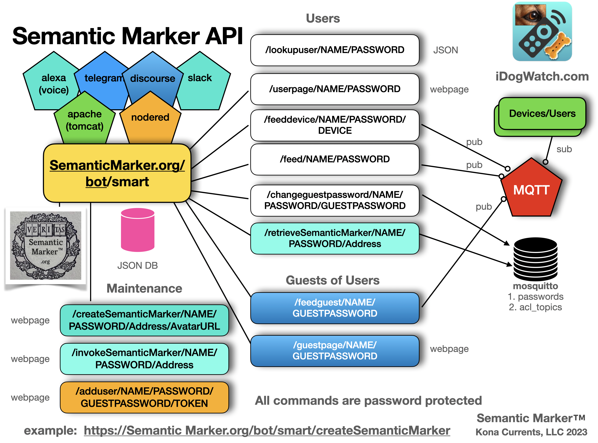

#  Semantic Marker ™️ API Manual


Creating and Processing with Semantic Marker™️ System is through various APIs (Application Programer Interface). This repository includes code that makes web calls using the http protocol and the javascript language. The following shows the interaction with the web services running at SemanticMarker.org. The code included is almost a 50-50 mix of html and javascript. As these are an HTTP API, other languages make calls on these same web API's. 
 



## Sample WEB javascript calls

This is called in the example javascript code at
[SampleSMWeb.html](sampleSMWeb.html)

# Semantic Marker API Web Interface

The main http/https calls to the SemanticMarker cloud services is documented as: 
[SemanticMarkerWebAPI.html](https://github.com/konacurrents/SemanticMarkerAPI/blob/main/SemanticMarkerWebAPI.html)

## SMART - Semantic Marker Augmented Reality of Things

The main interfaces to the SemanticMarker.org web services are through 
web calls embodied in the following web page code (and available at 
[SemanticMarker.org/smart](https://SemanticMarker.org/smart). This web page (with html and javascript) is just one way to interface with the SemanticMarker API calls. Other web pages have been created that have a different user interface, while calling the same API's. 

An example html web page with many javascript calls is includes <a href="smart.html">smart.html</a>

Example production web pages includes making appropriate API calls includes:
<a href="https://idogwatch.com/userpage/userpage.html?username=test&password=test">iDogWatch.com</a> and <a href="https://SemanticMarker.org/smart?username=test&password=test">SemanticMarker.org/smart</a>

## Semantic Marker javascript

The SMART web page makes calls through various javascript http calls (shown as XMLHttpRequest below). These are
embedded in the  <a href="smart.js">smart.js</a> code modules.

A typical <b>Http</b> web call looks like the following, passing in a command which includes calls to the appropriate web interface (for example https://SemanticMarker.org/bot/createSemanticMarker as shown in the diagram above). 

```javascript
//! sends the GET command to create a Semantic Marker
function createSemanticMarker(command)
{     
   var xhttp = new XMLHttpRequest();
   
   //!https://developer.mozilla.org/en-US/docs/Web/API/XMLHttpRequest/readystatechange_event
   xhttp.onreadystatechange = function() {
      // called when open is finished
      if (this.readyState == 4 && this.status == 200)
      {
          alert("SemanticMarker was created");
      }
   };

  xhttp.open("GET", command, true);
  xhttp.send();
}  

```

### Using the AvatarURL, once retrieved, the following will create the Semantic Marker final image

The commandPath (the Semantic Marker address is a parameter as is the avatarURL, and if the 
avatar is circular or rectangle)

```javascript
function createSemanticMarker(commandPath, avatarURL, circular)
{
try
   {
   // http web call to get the image from the AvatarURL
      getImage(avatarURL).then
      (
         function (successurl)
         {

            var sm = new SemanticMarker(document.getElementById(idSM),
               commandPath,
               avatarURL,
               circular);
         }).catch (function (errorurl)
         {

            alert("Issue creating Avatar in Semantic Marker&trade; creation: \n" + errorurl + "\nPlease file bug report");
         })

   }
   catch (error)
   {

      alert("Issue with Semantic Marker&trade; creation: \n" + error.message + "\nPlease file bug report");
   }
}
```

This is a http GET call. The http POST command is also supported where the payload can provide secure information as well as files, such as the Semantic Marker Avatar image. 

# Semantic Marker Examples with Avatar Images Embedded

The resulting Semantic Marker can look like the following examples.

