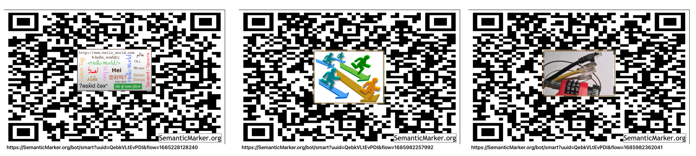
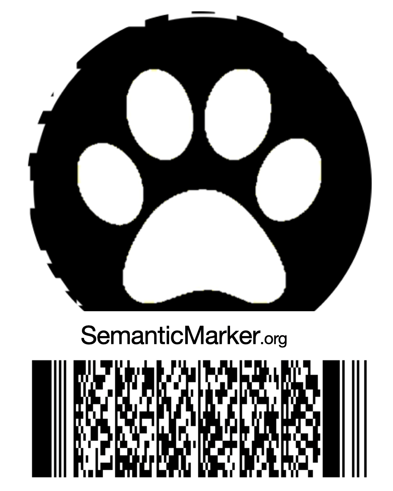

#  Semantic Marker ™️  REST and MQTT Message API Manual


Creating and Processing with the Semantic Marker™️  System is through various APIs (Application Programer Interface). This repository includes code that makes web calls using the <b>HTTP</b> protocol and various languages, such as javascript, c and objective-c. The following shows the interaction with the web services running at SemanticMarker.org. The code included is almost a 50-50 mix of html and javascript. As these are an HTTP API, other languages make calls on these same web API's. 

## SMART - Semantic Marker Augmented Reality of Things

The main interfaces to the SemanticMarker.org web services are through 
web calls embodied in the following web page code (and available at 
[SemanticMarker.org/smart](https://SemanticMarker.org/smart). This web page (with html and javascript) is just one way to interface with the SemanticMarker API calls. Other web pages have been created that have a different user interface, while calling the same API's. 

These fit an overall cloud and device interaction Semantic Marker architecture shown here 


# Semantic Marker REST API

The following are the main REST API calls to create and manage a Semantic Marker. 
The current base URL for these is [SemanticMarker.org](https://SemanticMarker.org) but the entire set
can also be run locally or moved to other web servers. For the Semantic Marker to be sharable and run
by outside parties, the Semantic Marker address URL must be publically available (for example, http://localhost would only
be usable for local testing, but https://SemanticMarker.org is globally accessible)

### Example Web Pages making REST API calls

An example html web page with many javascript calls via these REST APi's is included at: [smart.html](smart.html)

Example production web pages includes making appropriate API calls includes:
[iDogWatch.com](https://idogwatch.com/userpage/userpage.html?username=test&password=test) and 
[SemanticMarker.org](https://SemanticMarker.org/smart?username=test&password=test)

## Kona Currents, LLC offers three tiers of Semantic Marker offerings.

### Tier I. Semantic Marker Indirection
### Tier II.  Semantic Marker Store and Forward
### Tier III.  Semantic Marker SMART Button Management

------------------------------------------------------------------------------------------
# Tier I Semantic Marker Indirection

A Tier I Semantic Marker is a straight indirection to a remote address. These are created
directly from the various language implementation. Eamples of javascript, C and objective-c are shown. These
are snipits of code from various Semantic Marker apps to give a flavor of the APIs.

<details>
<summary><code>Javascript</code> <code><b>new SemanticMarker</b></code></summary>

##### Example javascript
[Example HTML with javascript](sampleSMWeb.html)

The SMART web page makes calls through various javascript http calls (shown as XMLHttpRequest below). These are
embedded in the  [smart.js](smart.js) code modules.

Excerpt from html file:

```javascript
//The commandPath (the Semantic Marker address is a parameter as is the avatarURL, and if the
//avatar is circular or rectangle).
function createSemanticMarker(commandPath, avatarURL, circular)
{
try
   {
   // http web call to get the image from the AvatarURL
      getImage(avatarURL).then
      (
         function (successurl)
         {

            var sm = new SemanticMarker(document.getElementById(idSM),
               commandPath,
               avatarURL,
               circular);
         }).catch (function (errorurl)
         {

            alert("Issue creating Avatar in Semantic Marker&trade; creation: \n" + errorurl + "\nPlease file bug report");
         })

   }
   catch (error)
   {

      alert("Issue with Semantic Marker&trade; creation: \n" + error.message + "\nPlease file bug report");
   }
}
```
#### Example of calling the web server to create a Tier II or Tier III Semantic Marker

A typical <b>Http</b> web call looks like the following, passing in a command which includes calls to the appropriate web interface (for example https://SemanticMarker.org/bot/createSemanticMarker as shown in the diagram above). 

```javascript
//! sends the GET command to create a Semantic Marker
function createSemanticMarker(command)
{     
   var xhttp = new XMLHttpRequest();
   
   //!https://developer.mozilla.org/en-US/docs/Web/API/XMLHttpRequest/readystatechange_event
   xhttp.onreadystatechange = function() {
      // called when open is finished
      if (this.readyState == 4 && this.status == 200)
      {
          alert("SemanticMarker was created");
      }
   };

  xhttp.open("GET", command, true);
  xhttp.send();
}  

```
</details>


<details>
<summary><code>ESP-32 M5 Code</code> <code><b>create Semantic Marker</b></code></summary>

This is a simple example of creating a Tier I Semantic Marker inside the ESP-32 code base.

##### Example ESP32 C Code
```c
   //!Draws a SemanticMarker&trade;
    //!Create a SemanticMarker code with a width of 135 QR code  at (0, 100).
    //!Please select the appropriate QR code version according to the number of characters. 
    createSemanticMarker("https://iDogWatch.com/bot/help",0,100,135);
    //try to draw a character in the middle ...
    printTextAtTextPosition("SM",_zoomedTextPositions[QRAVATAR_ACTION]);
```
</details>

<details>
<summary><code>Apple iOS Objective-C</code> <code><b>create Semantic Marker</b></code></summary>
This is a simple example of creating a Tier I Semantic Marker inside the iOS Apple Objective-c code base.

##### Example iOS ObjectiveC
```objectiveC
    //! create new image with the Avatar Logo inside
    UIImage *image = [self createSemanticMarker:address avatarImage:image];

```
</details>

------------------------------------------------------------------------------------------
# Tier II Semantic Marker Store and Forward

A Tier II Semantic Marker invoves storing information at one of our Semantic Marker cloud servers. This
include an indirect address that a valid user can modify. Later, the Tier III Semantic Marker provides
full user control.

## Creates a Tier II Semantic Marker using the Semantic Marker Address (escaped)

### Exists - called to see if this Semantic Marker has already been created
<details>
 <summary><code>GET</code> <code><b>/exists/ks/{category}/{namespace}/{UUID}/{escapedSemanticMarker}</b></code></summary>

#### Parameters

> | name      |  type     | data type               | description                                                           |
> |-----------|-----------|-------------------------|-----------------------------------------------------------------------|
> | namespace |  required | string                  | Namespace of Semantic Marker                                          |
> | category  |  required | string                  | Namespace of Semantic Marker                                          |
> | UUID      |  required | string                  | UUID of the user                                                      |
> | escapedAddress      |  required | string                  | The Semantic Marker Address is escaped so it is a single parameter argument|


#### Responses

> | http code     | content-type                      | response                                                            |
> |---------------|-----------------------------------|---------------------------------------------------------------------|
> | `201`         | `text/plain;charset=UTF-8`        | `Configuration created successfully`                                |
> | `400`         | `application/json`                | `{"code":"400","message":"Bad Request"}`                            |

#### Example cURL

> ```javascript
> set fullsm = "http://localhost:1880/exists/ks"
> curl -v  -F username=$user -F password=$pass -F link=$link -F kind=$kind $fullsm
> ```

</details>

### Assuming the Semantic Marker is unique, a new one is created (or trained)

### Train a semantic marker
<details>
 <summary><code>GET</code> <code><b>/train/ks/{namespace}/{category}/{UUID}/{escapedSemanticMarker}</b></code></summary>

##### Parameters

> | name      |  type     | data type               | description                                                           |
> |-----------|-----------|-------------------------|-----------------------------------------------------------------------|
> | namespace |  required | string                  | Namespace of Semantic Marker                                          |
> | category  |  required | string                  | Namespace of Semantic Marker                                          |
> | UUID      |  required | string                  | UUID of the user                                                      |
> | escapedAddress      |  required | string                  | The Semantic Marker Address is escaped so it is a single parameter argument|


##### Responses

> | http code     | content-type                      | response                                                            |
> |---------------|-----------------------------------|---------------------------------------------------------------------|
> | `201`         | `text/plain;charset=UTF-8`        | `Configuration created successfully`                                |
> | `400`         | `application/json`                | `{"code":"400","message":"Bad Request"}`                            |

##### Example cURL

> ```javascript
> set fullsm = "http://localhost:1880/train/ks"
> curl -v  -F username=$user -F password=$pass -F link=$link -F kind=$kind $fullsm
> ```

</details>

------------------------------------------------------------------------------------------
# Tier III Semantic Marker - SMART Buttons

A Tier III Semantic Marker provides storage for the Avatar image and for very fine control of
Semantic Marker actions. The created result is called a SMART Button - standing for Semantic Marker Augmented Reality of Things.

A SMART Button has a unique Semantic Marker address such as:

##### https://SemanticMarker.org/bot/smart?uuid=UUID&flow=flowNUM

#### Creating a Semantic Marker with an embedded Avatar Image
##### Digitize an image for use in a Semantic Marker Avatar (Note should have been cropped by the user)
<details>
 <summary><code>POST</code> <code><b>/{namespace}/{category}/{UUID}/digitize</b></code> </summary>

##### Parameters

> | name      |  type     | data type               | description                                                           |
> |-----------|-----------|-------------------------|-----------------------------------------------------------------------|
> | namespace |  required | string                  | Namespace of Semantic Marker                                          |
> | category  |  required | string                  | Namespace of Semantic Marker                                          |
> | UUID      |  required | string                  | UUID of the user                                                      |

##### Responses

> | http code     | content-type                      | response                                                            |
> |---------------|-----------------------------------|---------------------------------------------------------------------|
> | `201`         | `text/plain;charset=UTF-8`        | `http URL of resulting Avatar Image`                                |
> | `400`         | `application/json`                | `{"code":"400","message":"Bad Request"}`                            |

##### Payload
###### multipart/form-data

1.  Image file to be digitized

2. JSON of credentials

Like many of these interfaces, the credentials including the username and password, are passed as part of the payload in these POST calls.
```json
{
   "username":_username,
   "password":_password,
   "name" : flowName,
   "uuid" : uuid,
   "flowNum"  : flowNum,
   "flowCat"  : flowCat
}
```
##### Example cURL POST

> ```shell
> set fullsm = "https://SemanticMarker.org/bot/sm/$name/$cat/$uuid"
> curl --trace-ascii curl.trace  \
> -F filename=$filename \
> -F upload=@$filename \
> -F username=$user \
> -F password=$pass \
> -F link=$link \
> -F uuid=$uuid \
> -F flownum=$flownum \
> -F flowcat=$flowcat \
> -F kind=$kind \
> $fullsm

> ```

</details>


##### Create a SMART Button for an existing user of the Semantic Marker system
<details>
 <summary><code>POST</code> <code><b>/smflowpost</b></code> </summary>

##### Parameters

> | name      |  type     | data type               | description                                                           |
> |-----------|-----------|-------------------------|-----------------------------------------------------------------------|


##### Responses

> | http code     | content-type                      | response                                                            |
> |---------------|-----------------------------------|---------------------------------------------------------------------|
> | `201`         | `text/plain;charset=UTF-8`        | `http URL of resulting Avatar Image`                                |
> | `400`         | `application/json`                | `{"code":"400","message":"Your SemanticMarker Address was already registered."}`                            |

##### Payload
###### multipart/form-data

1. JSON of credentials for the SMART Button

Like many of these interfaces, the credentials including the username and password, are passed as part of the payload in these POST calls.
```json
{
    "username":_username,
    "password":_password,
    "name" : flowName,
    "uuid" : uuid,
    "isdata": isDataFlag,
    "private": privateflag,
    "flowNum"  : flowNum,
    "flowCat"  : flowCat,
    "date" : dateString,
    "parameters" : parameters,
    "desc": desc,
    "QRAvatarURL":QRAvatarURL,
    "nextFlowURL":nextFlowURL,
    "flow" : allCommandsJSON,

    "dataSM" : dataSM,
    "KSMatrix" : KSMatrixText,
    "artifactsSM" : artifactsSM,
    "markup" : markupText,
    "languagesSM": languagesSM,
    "videoSM": videoSM,
    "isCircularAvatar": isCircularAvatar,

    "KSWave" : KSWaveText,
    "bridgeSM" : bridgeSM,
    "future" : futureText,

    "audioSM" : audioSM,
    "locationSM" : locationSM,
    "inheritedSM" : inheritedSM,
    "deckSM" : deckSM,
    "isMessaging" : isMessaging,
    "isIndirectSM" : isIndirectSM,
    "indirectSM" : indirectSM
}
```
##### Example cURL POST

> ```shell
> set fullsm = "https://SemanticMarker.org/bot/smflowpost"
> curl --trace-ascii curl.trace  \
> $fullsm

> ```

</details>

------------------------------------------------------------------------------------------
# Messaging Grammer 

These are the Websocket and MQTT messaging formats. This includes the legacy websocket interface
defined as the <b>Barklet Language</b>. The format is a mix of original Barklet Language used with WebSockets,
and the newer JSON Format messages.

Many of the messages described in the following BNF Grammer can be run
through the shell commands at: [Example curl commands](curlCommands)
To run, doload the scripts and run with a valid username and password.

## BNF Grammer for Barklet Language

```objc
/*
 * Description = Grammer for Barklet communication
 * --- BNF: NOTE: {} are part of language not BNF
 * --NOTE: <guest ID> ":"  -- created by chat-room, not user messages
 *   message          ::= [<guest ID> ":"] <payload> <player_name> [<time>] 
 *                   | '{' [<device>] <JSONMessage> '}'
 *   payload          ::= <request> [<deviceInfo>] [<SemanticMarker>] [<OTA>]| <reply>
 *   request          ::= #STATUS | #TEMP | #CAPTURE | #FEED | #VERSION | #DOCFOLLOW | #followMe | #CLEAN_SSID_EPROM | #OTA
 *   reply            ::=  <connection>
 *                       | <location>
 *                   | <biometrics> <bot_name>
 *                   | <ack>
 *                   | <chat>
 *                   | <version>
 *                   | <distanceTo< <bot_name>
 *   SemanticMarker   ::= AVM= <SMAddress>
 *   SMAddress        ::= SemanticMarkerURL
 *   OTA              ::= {v=Version} | {k=<kind>}
 *   kind             ::= ESP_M5 | ESP_32
 *   connection       ::= <connectionStatus> <status>
 *   connectionStatus ::= <connectionPhase> <bot_name> | #REMOTE
 *   connectionPhase  ::= #CONNECTED | #WAITING | #DISCONNECTED
 *   status           ::= {I,F,remote}   //Inside network, Foreground  || Outside, background
 *   location         ::= #GPS <loc>
 *   loc              ::= {nil} | {<lat:float>,<lon:float>,<alt-feet:float>}
 *   chat             ::= #CHAT_CONNECTED | #CHAT_DISCONNECTED
 *   ack              ::= #ACK <ack_kind>
 *   ack_kind         ::= <ack_feed> | <docfollow>
 *   ack_feed         ::= "Fed" <bot_name>
 *   biometrics       ::= <temp> | <acceleration>
 *   temp             ::= {TempF=<float>}
 *   acceleration     ::= {Acc=<floatX>,<floatY>,<floatZ>}
 *   deviceInfo       ::= <identity> | {"deviceName":<name>}
 *   bot_name         ::= <identity>
 *   player_name      ::= <identity>
 *   identity         ::= {<name> [<UUID>]}
 *   UUID             ::= <32 bit name>
 *   float            ::= <int> : <int>
 *   time             ::= {hh:mm:ss}
 *   version          ::= {ver=x.x}
 *   number           ::= <int>
 *   boolean          ::= "on" | "off"
 *
 *   JSONMessage      ::= <set> | <send> | <set64> | <SemanticMarkerApp Messages>
 *   device           ::= "device" : name_of_device
 *   set              ::= "set" : setString , "val": valString
 *   send             ::= "send" : sendString
 *   set64            ::= "set64" : <encodedBase64String>
 *   setString        ::= "semanticMarker" 
 *                     | "highTemp" <number>
 *                     | "feed" <boolean>
 *                     | "status" <boolean>
 *                     | "resetTimer" <boolean>
 *                     | "devOnlySM" <boolean>
 *                     | "ble+wifi" <boolean>
 *                     | "factoryReset" <boolean>
 *                     | "restartModels" <boolean>
 *                     | "screenTimeout" <number>
 *                     | "stepperAngle" <number>
 *                     | "noclick"  <boolean>
 *                     | "gateway"  <boolean>
 *                     | "DiscoverM5PTClicker"  <boolean>
 *                     | "useSPIFF"  <boolean>
 *                     | "timerDelay" <number>
 *                     | "startTimer"  <boolean>
 *                     | "stepper"  <number>
 *                     | "clockWiseMotor" <boolean>
 *                     | "otaFile" <string>
 *                     | "location" <string>
 *                     | "device"  <string>
 *                     | "pairNow"  <boolean>
 *                     | "pairDev" <string>
 *                     | "useGroups" <boolean>
 *                     | "groups" <boolean>
 *                     | "screenColor" <number>
 *                     | "gen3only" <boolean>
 *                     | "BLEUsePairedDeviceName" <boolean>
 *                     | "BLEUseDeviceName" <boolean>
 *                     | "minMenue" <boolean>
 *                     | "addWIFI" <boolean>
 *                     | "useDOCFOLLOW" <boolean>
 *                     | "semanticMarker" 
 *                     | "blankscreen" <boolean>
 *                     | "SubDawgpack" <boolean>
 *                     | "buzz" <boolean>
 *                     | "BLEClient" <boolean>
 *                     | "BLEServer" <boolean>
 *                     | "tilt" <boolean>
 *                     | "zoomSM" <SMNum>
 *                     | "buttonA" ["longpress" | "shortpress"]
 *                     | "buttonB" ["longpress" | "shortpress"]
 *   sendString      ::= "temp" 
 *                     | "status" 
 *                     | "capture" 
 *                     | "volume" 
 *                     | "feed" 
 *   encodedBase64String ::=
 *                     |  <Semantic Marker value after decoding base64>
 *   SemanticMarkerApp Messages ::=
 *                     | DEBUG <boolean>
 *                     | HUD <boolean>
 *                     | MQTT_DEBUG <boolean>
 *                     | SMFocusCapture <boolean>
 *                     | SMSharing <boolean>
 *                     | SMSharingLeader <boolean>
 *                     | SM_AR_Minimal <boolean>
 *                     | SM_AR_ZOOM <boolean>
 *                     | SM_AR_Zoom <boolean>
 *                     | SM_Flip <boolean>
 *                     | SM_FlipRotate <boolean>
 *                     | SM_Instance_Image <boolean>
 *                     | SM_QRAvatar <boolean>
 *                     | SM_ReplaceUUID <boolean>
 *                     | SM_UseCropImage <boolean>
 *                     | SM_VisionLinker <boolean>
 *                     | animals <boolean>
 *                     | images <boolean>
 *                     | matrix <boolean>
 *                     | noclick <boolean>
 *                     | pause <boolean>
 *                     | pdf <boolean>
 *                     | replaceUUID <UUID string>
 */
```


------------------------------------------------------------------------------------------
# Additional Interaction with the SMART Button Infrastructure

Outside of creating a Semantic Marker, modification and invocation is out of scope of this API document. One
web page that encapsulates most of these interactions can seen at:  [SemanticMarker.org/smart](https://SemanticMarker.org/smart)

# Semantic Marker Examples with Avatar Images Embedded

The Semantic Marker supports existing and future two-dimensional optical vision markers. The following are a couple examples.

The resulting Semantic Marker can look like the following examples.

## SMART Buttons


## Alternate two-dimensional optical codes


## Semantic Marker on a small ESP-32 M5 display
This Semantic Marker might change every second to reflect sensor status.

